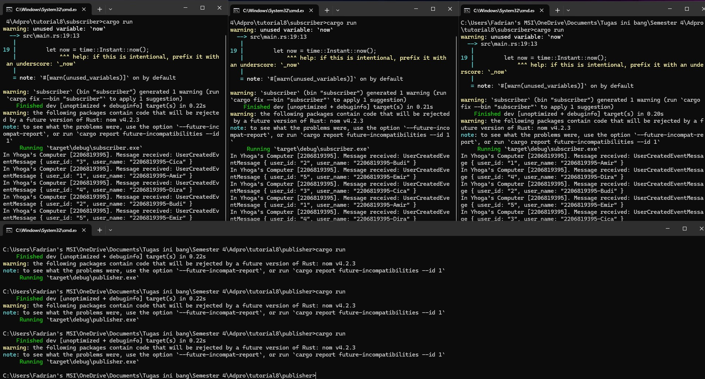

# Pemrograman Lanjut A
> Fadrian Yhoga Pratama - 2206819395

## Module 8 - Software Architectures

1. **what is amqp?**  
AMQP adalah singkatan dari Advanced Message Queuing Protocol. Ini adalah desain standar untuk middleware messaging yang memungkinkan komunikasi antara sistem atau komponen yang berbeda.

2. **what it means? guest:guest@localhost:5672 , what is the first quest, and what is the second guest, and what is localhost:5672 is for?** 
   - `guest:guest@localhost:5672` adalah string koneksi yang digunakan untuk terhubung ke broker AMQP. Ini terdiri dari tiga bagian:
     - `guest:guest`: Ini adalah kombinasi **nama pengguna** dan **kata sandi** yang digunakan untuk autentikasi. Dalam hal ini, baik nama pengguna maupun kata sandi adalah "guest".
     - `localhost:5672`: Ini menunjukkan nama host dan nomor port dari broker AMQP. Dalam hal ini, itu terhubung ke broker yang berjalan di localhost menggunakan port 5672.

3. **Simulation slow subscriber.**

> Saya menjalankan publisher sebanyak 3 kali dan dan dapat dilihat bahwa queued messagenya mencapai 10, artinya terdapat 10 message yang ada pada antrian sebelum nantinya diterima subscriber. Saya disini menghapus comment pada `thread::sleep(ten_millis);` yang artinya saya membuat subsciber memberikan delay untuk tiap prosesnya dalam menerima data dari message broker. Yang terjadi, queued messages pada message broker akan bertambah seiring dengan bertambahnya delay karena publisher mengirim lebih cepat dibandingkan subscriber menerima.

4. **Reflection and Running at least three subscribers.**

> Saya melakukan hal yang sama seperti pada Simulation slow subscriber yaitu menjalankan publisher secara cepat sebanyak 3 kali. Bedanya sekarang saya menjalankan subscribernya sebanyak 3 yang membuat pengiriman datanya menjadi lebih cepat dan menghasilkan jumlah queued message yang lebih sedikit. Seperti yang dapat dilihat bahwa yang sebelumnya queued messages nya sebanyak 10, sekarang berkurang menjadi 3. Hal ini terjadi karena message broker mendistribusikan data yang diterima dari publisher ke semua subscriber yang terhubung.